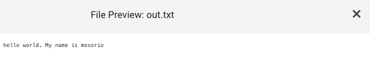

This tutorial is the first in a [series of tutorials](#next-tutorials) that will guide you through the process of creating a cookbook and running it on TACC systems. From simple ones that run a command to more complex ones that run a Python using conda or a Jupyter Notebook.

## Requirements

- A GitHub account
- TACC account. If you don't have one, you can request one [here](https://accounts.tacc.utexas.edu/register)
- To access TACC systems, you should have an [allocation](https://tacc.utexas.edu/use-tacc/allocations/)
  - You can see your allocations [here](https://ptdatax.tacc.utexas.edu/workbench/allocations/approved)
  - If you don't have an allocation, you can request one [here](https://portal.tacc.utexas.edu/allocation-request)

## Tutorial

In this tutorial, we will create a simple cookbook that will be used to demonstrate how to run a cookbook a TACC cluster and obtain the output using a UI.

This cookbook will run the job using two parameters/arguments `Greeting` and `Target` and save the output to a file named `out.txt`.

### How does it work?

1. The [`app.json`](app.json) file contains the definition of the Tapis application, including the application's name, description, Docker image, parameters and advanced options.
2. The Docker image defines the runtime environment for the application. Also, it includes `run.sh` file that contains the commands that will be executed by the Tapis job. A Docker Image is built from the [`Dockerfile` file](./Dockerfile).
3. The file [`run.sh`](run.sh) contains all the commands that will be executed by the Tapis job.

### 1. Update the Cookbook Definition `app.json` File

Each app has a unique `id` and `description`. So, you should change these fields to match your app's name and description.

1. Download the `app.json` file
2. Change the values `id` and `description` fields with the name and description as you wish.

### Create a New Application on the Cookbook UI

1. Go to [Cookbook UI](https://in-for-disaster-analytics.github.io/cookbooks-ui/#/apps)
2. Click on the "Create Application" button
3. Fill in the form with the information from your `app.json` file
4. Click "Create Application"
5. A new application will be created, and you will be redirected to the application's page

### Run Your Cookbook

1. Click on the "Run" button on the right side of the page. This will open the Portal UI
2. Fill in the form with the necessary parameters
3. Click "Run"

### Check the Output

1. After the job finishes, you can check the output by clicking on the "Output location" link on the job's page
   
2. You will be redirected to the output location, where you can see the output files generated by the job
   
3. Click on a file to see its content. In this case, the file is named `out.txt`
   

## Next Tutorials

- [Running a Python script]
- [Running a Jupyter Notebook]

## Authors

William Mobley - wmobley@tacc.utexas.edu
Maximiliano Osorio
